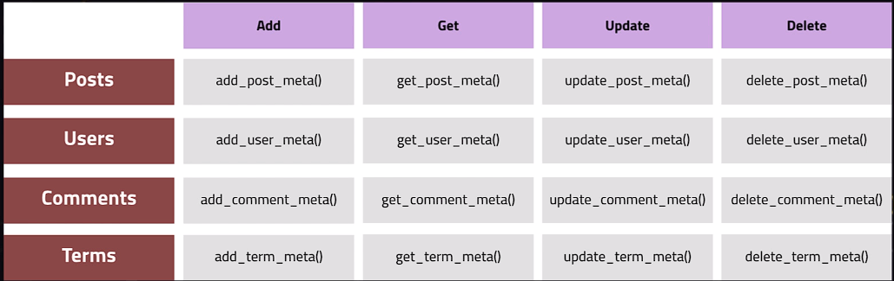
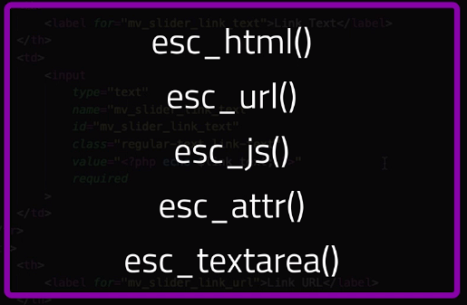

# Criação de Plugins WordPress do Jeito Certo

https://www.udemy.com/course/crie-plugins-wordpress-do-jeito-certo/


## <a name="indice">Índice</a>

1. [Seção 1: Introdução](#parte1)     
2. [Seção 2: Antes de Começar](#parte2)     
3. [Seção 3: Projeto #1 - MV Slider](#parte3)     
4. [Seção 4: Projeto #2 - MV Testimonials](#parte4)     
5. [Seção 5: Projeto #3 - MV Translations](#parte5)     
6. [Seção 6: Conclusão](#parte6)     
---


## <a name="parte1">1 - Seção 1: Introdução</a>

```text
Arquivos e outros materiais
Você pode ter acesso a todos os códigos e materiais extras para este curso clicando no seguinte link:

https://drive.google.com/file/d/1gRj3r20fcPpSyYw7o09oA_R2Gf9in4sA/view?usp=sharing

Assista o vídeo abaixo pra ver um exemplo de como baixar o material:

https://www.youtube.com/watch?v=L0MRLdonb14

Como fazer?

Baixe e extraia o arquivo compactado para o seu computador. O material é todo organizado por aula.

Use o material para comparar o seu código como o meu quando necessário.

Algumas aulas possuem material inicial que deve ser copiado e colado para acompanhar o conteúdo. Siga as instruções das aulas para utilizar o material correto.


Como enviar material de teste para o instrutor?
Siga as instruções deste vídeo: https://www.youtube.com/watch?v=t_gDIZvLnq8


Projetos Finais do Curso
Acesse os arquivos com todos os projetos deste curso no GitHub:

https://github.com/marceloquinze/Projetos-do-Curso-Plugins-WordPress
```

[Voltar ao Índice](#indice)

---


## <a name="parte2">2 - Seção 2: Antes de Começar</a>

- [https://developer.wordpress.org/reference/](https://developer.wordpress.org/reference/)


**WordPress Flow**
```text

load wp-config.php
set up default constants
load wp-content/advanced-cache.php if it exists
load wp-content/db.php if it exists
connect to mysql, select db
load object cache (object-cache.php if it exists, or wp-include/cache.php if not)
load wp-content/sunrise.php if it exists (multisite only)
load l10n library
load mu plugins
DO_ACTION 'muplugins_loaded' (only accessible to mu plugins)
load active plugins
load pluggables.php
DO_ACTION 'plugins_loaded' (first hook available to plugins)
load rewrite rules
instantiate $wp_query, $wp_rewrite and $wp.
	$wp_query is a global instance of the WP_Query class. For more info, see ANY QUERY
	$wp_rewrite is a global instance of the WP_Rewrite class and contains our rewrite rules and functions
	$wp is a global instance of the WP class and contains the functions that will parse our request and perform the main query (see REQUEST)
DO_ACTION 'setup_theme'
include child theme functions.php
include parent theme functions.php
DO_ACTION 'after_setup_theme' (first hook available to themes)
set up current user object
DO_ACTION 'init'
register widgets (DO_ACTION 'widget_init')
call wp() (which calls $wp->main())


REQUEST
=======

$wp->parse_request()
	loop over rewrite rules to find a match
	APPLY_FILTERS 'query_vars' to the publicly available query vars
	fill query vars with $_POSTs, $_GETs, and rewritten vars
	APPLY_FILTERS 'request' to the request variables
	DO_ACTION_REF_ARRAY 'parse_request' with array of request vars (query vars, request, matched rewrite rules, etc)

DO_ACTION_REF_ARRAY 'send_headers' with the 'WP' object.

THE MAIN QUERY
==============

$wp->query_posts()
	goto ANY QUERY

if posts are empty, set is_404() (and send 404 headers)
set all the query_vars to global variables
DO_ACTION_REF_ARRAY 'wp' with the main WP object


	ANY QUERY
	=========

	WP_Query->query( query vars )
		WP_Query->parse_query( query vars )
			build query parameters based off query vars
			set WP_Query->is_* vars based off query parameters
				if this query is $wp_the_query then these determine the values of the global is_*() functions too
			DO_ACTION_REF_ARRAY 'parse_query' with WP_Query object (query parameters, query vars, conditionals)
		WP_Query->get_posts()
			DO_ACTION_REF_ARRAY 'pre_get_posts' with WP_Query object
			APPLY_FILTERS_REF_ARRAY 'posts_search' with search SQL
			series of APPLY_FILTERS on the query SQL (if suppress_filters=false):
			 * posts_where
			 * posts_join
			 * posts_where_paged
			 * posts_groupby
			 * posts_join_paged
			 * posts_orderby
			 * posts_distinct
			 * post_limits
			 * posts_fields
			 * posts_clauses
			APPLY_FILTERS_REF_ARRAY 'posts_request' (if suppress_filters=false)
			fetch posts from the database
			APPLY_FILTERS_REF_ARRAY 'posts_results' (if suppress_filters=false)
			prepend sticky posts
			APPLY_FILTERS_REF_ARRAY 'the_posts' (if suppress_filters=false)
			return posts

TEMPLATE
========

DO_ACTION 'template_redirect'
if is_feed()
	load the feed template
else
	look for template file in theme based on template hierarchy
	APPLY_FILTERS 'template_include'
	load the template file (which usually runs a loop @TODO document a loop)
DO_ACTION 'shutdown'
```
FONTE: https://gist.github.com/johnbillion/4fa3c4228a8bb53cc71d


- [https://codex.wordpress.org/Plugin_API/Filter_Reference](https://codex.wordpress.org/Plugin_API/Filter_Reference)

 -[wp-proj01/wp-content/themes/twentynineteen/functions.php](wp-proj01/wp-content/themes/twentynineteen/functions.php)

```php

function add_div_tag_before() {
	?>
    <div class="test-div">THE LOOP STARTED
		<?php
		}
		add_action( 'loop_start', 'add_div_tag_before', 10 );

		function add_div_tag_after(){
		?>
        THE LOOP ENDED!
    </div>
	<?php
}
add_action( 'loop_end', 'add_div_tag_after', 11 );

function modify_content( $content ) {
	return $content . 'COnteudo Adicionado por Filtros!!!';
}

add_filter( 'the_content', 'modify_content' );

/*
   function modify_body_classes( $classes, $class ) {
	if ( is_single() ) {
		$class[] = 'test_add_single';
		$classes = array_merge( $classes, $class );
	}

	return $classes;
}*/
function modify_body_classes( $classes, $class = null ) {
	if ( is_single() ) {
		$classes[] = 'test_add_single';
	}

	return $classes;
}

add_filter( 'body_class', 'modify_body_classes', 10, 2 );

```


[Voltar ao Índice](#indice)

---


## <a name="parte3">3 - Seção 3: Projeto #1 - MV Slider</a>

- 10 Conhecendo o projeto do plugin MV Slider

- 11 Estruturando o plugin

- [https://developer.wordpress.org/plugins/plugin-basics/header-requirements/](https://developer.wordpress.org/plugins/plugin-basics/header-requirements/)

```php
<?php

/**
 * Plugin Name:       MV SLIDER
 * Plugin URI:        https://josemalcher.net/wordpress
 * Description:       Estudos - Slider Simples
 * Version:           0.1
 * Requires at least: 5.8
 * Requires PHP:      7.2
 * Author:            José Malcher Jr
 * Author URI:        https://josemalcher.net
 * License:           GPL v2 or later
 * License URI:       https://www.gnu.org/licenses/gpl-2.0.html
 * Text Domain:       mv-sliders
 * Domain Path:       /languages
 */


/*
MV-SLIDER is free software: you can redistribute it and/or modify
it under the terms of the GNU General Public License as published by
the Free Software Foundation, either version 2 of the License, or
any later version.

MV-SLIDER is distributed in the hope that it will be useful,
but WITHOUT ANY WARRANTY; without even the implied warranty of
MERCHANTABILITY or FITNESS FOR A PARTICULAR PURPOSE. See the
GNU General Public License for more details.

You should have received a copy of the GNU General Public License
along with MV-SLIDER. If not, see https://www.gnu.org/licenses/gpl-2.0.html.
*/

if ( ! defined( 'ABSPATH' ) ) {
	// die( 'not today' );
	exit;
}

```

- [https://developer.wordpress.org/plugins/plugin-basics/including-a-software-license/](https://developer.wordpress.org/plugins/plugin-basics/including-a-software-license/)
- [https://make.wordpress.org/themes/handbook/review/resources/#licenses-bundled-resources](https://make.wordpress.org/themes/handbook/review/resources/#licenses-bundled-resources)

- 12 Plugins com classes Vs Plugins sem classes

- [wp-proj01/wp-content/plugins/mv-slider/mv-slider.php](wp-proj01/wp-content/plugins/mv-slider/mv-slider.php)

```php
if ( ! defined( 'ABSPATH' ) ) {
	// die( 'not today' );
	exit;
}

if ( ! class_exists( 'MV_Slider' ) ) {
	class MV_Slider {

		public function __construct() {
		}
	}
}

if ( class_exists( 'MV_Slider' ) ) {
	$mv_slider = new MV_Slider();
}

```


- 13 Definindo constantes

- [https://developer.wordpress.org/plugins/plugin-basics/determining-plugin-and-content-directories/](https://developer.wordpress.org/plugins/plugin-basics/determining-plugin-and-content-directories/)

- [wp-proj01/wp-content/plugins/mv-slider/mv-slider.php](wp-proj01/wp-content/plugins/mv-slider/mv-slider.php)

```php
if ( ! class_exists( 'MV_Slider' ) ) {
	class MV_Slider {

		public function __construct() {
			$this->define_constants();
		}

		public function define_constants(){
			define('MV_SLIDER_PATH', plugin_dir_path(__FILE__));
			define('MV_SLIDER_URL', plugin_dir_url(__FILE__));
			define('MV_SLIDER_VERSION', '0.1.0');
		}
	}
}

```

- 14 Métodos activate, deactivate e uninstall

- [https://developer.wordpress.org/plugins/plugin-basics/uninstall-methods/#method-2-uninstall-php](https://developer.wordpress.org/plugins/plugin-basics/uninstall-methods/#method-2-uninstall-php)

```php
if ( ! class_exists( 'MV_Slider' ) ) {
	class MV_Slider {

		public function __construct() {
			$this->define_constants();

		}

		public function define_constants() {
			define( 'MV_SLIDER_PATH', plugin_dir_path( __FILE__ ) );
			define( 'MV_SLIDER_URL', plugin_dir_url( __FILE__ ) );
			define( 'MV_SLIDER_VERSION', '0.1.0' );
		}

		public static function activate() {
			// flush_rewrite_rules();
			update_option( 'rewrite_rules', '' );
		}

		public static function deactivate() {
			flush_rewrite_rules();
		}

		public static function uninstall() {

		}
	}
}

if ( class_exists( 'MV_Slider' ) ) {
	register_activation_hook( __FILE__, array( 'MV_Slider', 'activate' ) );
	register_deactivation_hook( __FILE__, array( 'MV_Slider', 'deactivate' ) );
	register_uninstall_hook( __FILE__, array( 'MV_Slider', 'uninstall' ) );
	$mv_slider = new MV_Slider();
}
```

- 15 Criando o tipo de post customizado (CPT) para o plugin - parte 1

- [wp-proj01/wp-content/plugins/mv-slider/post-types/class.mv-slider-cpt.php](wp-proj01/wp-content/plugins/mv-slider/post-types/class.mv-slider-cpt.php)

```php
<?php

if ( ! class_exists( 'MV_Slider_Post_Type' ) ) {
	class MV_Slider_Post_Type {
		function __construct() {
			add_action( 'init', array( $this, 'create_post_type', ) );
		}

		public function create_post_type() {

		}

	}
}

```

- 16 Criando o tipo de post customizado (CPT) para o plugin - parte 2

- [https://developer.wordpress.org/reference/functions/register_post_type/#comment-351](https://developer.wordpress.org/reference/functions/register_post_type/#comment-351)
- [https://developer.wordpress.org/reference/functions/register_post_type/](https://developer.wordpress.org/reference/functions/register_post_type/)
- [https://developer.wordpress.org/resource/dashicons/#star-filled](https://developer.wordpress.org/resource/dashicons/#star-filled)
- [https://developer.wordpress.org/reference/functions/register_post_type/#menu_icon](https://developer.wordpress.org/reference/functions/register_post_type/#menu_icon)

```php
<?php

if ( ! class_exists( 'MV_Slider_Post_Type' ) ) {
	class MV_Slider_Post_Type {
		function __construct() {
			add_action( 'init', array( $this, 'create_post_type' ) );
		}

		public function create_post_type() {
			register_post_type(
				'mv-slider',
				array(
					'label'               => 'Slide MV',
					'description'         => 'Sliders',
					'labels'              => array(
						'name'          => 'Sliders',
						'singular_name' => 'Slider'
					),
					'public'              => true,
					'supports'            => array( 'title', 'editor', 'thumbnail' ),
					'hierarchical'        => false,
					'show_ui'             => true,
					'show_in_menu'        => true,
					'menu_position'       => 5,
					'show_in_admin_bar'   => true,
					'show_in_nav_menus'   => true,
					'can_export'          => true,
					'has_archive'         => false,
					'exclude_from_search' => false,
					'publicly_queryable'  => true,
					'show_in_rest'        => true,
					'menu_icon'           => 'dashicons-images-alt2'
				) );
		}
	}
}

```

- 17 API Metabox - O que são metadados?

- [https://www.engagewp.com/adding-metadata-api-support-to-custom-objects-in-wordpress-the-complete-guide/](https://www.engagewp.com/adding-metadata-api-support-to-custom-objects-in-wordpress-the-complete-guide/)

- 18 API Metabox - Adicionando metaboxes

- [wp-proj01/wp-content/plugins/mv-slider/post-types/class.mv-slider-cpt.php](wp-proj01/wp-content/plugins/mv-slider/post-types/class.mv-slider-cpt.php)

```php
        function __construct() {
			add_action( 'init', array( $this, 'create_post_type' ) );

			add_action( 'add_meta_boxes', array( $this, 'add_meta_boxes' ) );
		}
        public function add_meta_boxes(){
			add_meta_box(
				'mv_slider_meta_box',
				'Link Options',
				array( $this, 'add_inner_meta_boxes' ),
				'mv-slider',
				'normal',
				'high'
			);
		}

		public function add_inner_meta_boxes( $post ){

		}
```

- 19 API Metabox - Criando formulário para a metabox

- 20 API Metabox - Salvando dados da metabox



- 21 API Metabox - Validando e sanitizando informação

Lista com funções de sanitização usadas pelo WordPres:
```text
- sanitize_email(): retira todos os caracteres não permitidos num endereço de email;
- sanitize_file_name(): sanitiza um nome de arquivo, substituindo espaços em branco por traços;
- sanitize_html_class(): sanitiza um nome de classe HTML, deixando apenas caracteres válidos;
- sanitize_key(): sanitiza o nome de uma chave (identificador interno), permitindo caracteres alfanuméricos em letras minúsculas, traços e sublinhados;
- sanitize_meta(): sanitiza um valor de chave meta;
- sanitize_mime_type(): sanitiza um mime type (tipo de mídia);
- sanitize_option(): sanitiza uma opção com base no seu tipo. Os tipos são definidos por uma declaração switch e passados como primeiro parâmetro. No segundo parâmetro é passado o valor a sanitizar. Ums lista pode ser encontrada no endereço abaixo: https://codex.wordpress.org/Function_Reference/sanitize_option#Notes
- sanitize_sql_orderby(): assegura que a string passada é uma cláusula ‘order by’ SQL válida;
- sanitize_text_field(): sanitiza dados passados como texto, removendo todas as tags, espaços em branco do início e do fim do texto, espaços extras, quebras, tabulações, conteúdo UTF-8 inválido. Ainda, transforma sinais < em entidades HTML;
- sanitize_title(): sanitiza um título (para posts, páginas etc), retirando tags PHP e HTML. Se o título estiver em branco, permite informar um valor padrão;
- sanitize_title_for_query(): sanitiza um título para uso em consultas por um valor de URL;
- sanitize_title_with_dashes(): sanitiza um título, substituindo espaços em branco e alguns outros caracteres por traços;
- sanitize_user(): sanitiza um nome de usuário, retirando caracteres inseguros;
- esc_url_raw(): aplica a função de escape esc_url(), usada para campos do tipo URL, para uso em banco de dados;
- wp_filter_post_kses() e wp_kses_post(): sanitizam um conteúdo para aceitar apenas tags HTML permitidas em posts;
- wp_kses(): permite apenas uma lista de tags HTML especificadas pelo desenvolvedor;
- wp_kses_data(): sanitiza um conteúdo deixando apenas HTML permitido pela regra da função wp_kses();
- wp_filter_nohtml_kses(): retira todo o conteúdo HTML de uma string de texto;
- sanitize_hex_color(): sanitiza uma informação, retornando um código de cor hexadecimal válido, com 3 ou 6 dígitos (precedidos do sinal #), ou retorna vazio;
- sanitize_hex_color_no_hash(): o mesmo que a função anterior, sem retornar o sinal #;
- wp_rel_nofollow(): adiciona rel=”nofollow” a todo elemento HTML <a> do conteúdo passado;
- absint(): converte o valor passado para inteiro positivo. 

Para mais detalhes sobre essas funções, verifique a documentação do WordPress.
 ```

- [wp-proj01/wp-content/plugins/mv-slider/post-types/class.mv-slider-cpt.php](wp-proj01/wp-content/plugins/mv-slider/post-types/class.mv-slider-cpt.php)

```php
public function save_post( $post_id ) {
			if ( isset( $_POST['action'] ) && $_POST['action'] == 'editpost' ) {
				$old_link_text = get_post_meta( $post_id, 'mv_slider_link_text', true );
				$new_link_text = $_POST['mv_slider_link_text'];
				$old_link_url  = get_post_meta( $post_id, 'mv_slider_link_url', true );
				$new_link_url  = $_POST['mv_slider_link_url'];

				if ( empty( $new_link_text ) ) {
					update_post_meta( $post_id, 'mv_slider_link_text', 'Add some text' );
				} else {
					update_post_meta( $post_id, 'mv_slider_link_text', sanitize_text_field( $new_link_text ), $old_link_text );
				}

				if ( empty( $new_link_url ) ) {
					update_post_meta( $post_id, 'mv_slider_link_url', '#' );
				} else {
					update_post_meta( $post_id, 'mv_slider_link_url', sanitize_text_field( $new_link_url ), $old_link_url );
				}


			}
		}
```

- 22 API Metabox - Escapando informação



- [wp-proj01/wp-content/plugins/mv-slider/views/mv-slider_metabox.php](wp-proj01/wp-content/plugins/mv-slider/views/mv-slider_metabox.php)

```php
<?php
    $meta      = get_post_meta( $post->ID );
    $link_text = get_post_meta( $post->ID, 'mv_slider_link_text', true );
    $link_url  = get_post_meta( $post->ID, 'mv_slider_link_url', true );
    //var_dump( $link_text, $link_url );
?>
<table class="form-table mv-slider-metabox">
    <tr>
        <th>
            <label for="mv_slider_link_text">Link Text</label>
        </th>
        <td>
            <input
                    type="text"
                    name="mv_slider_link_text"
                    id="mv_slider_link_text"
                    class="regular-text link-text"
                    value="<?php echo ( isset( $link_text ) ) ? esc_html( $link_text ) : ''; ?>"
                    required
            >
        </td>
    </tr>
    <tr>
        <th>
            <label for="mv_slider_link_url">Link URL</label>
        </th>
        <td>
            <input
                    type="url"
                    name="mv_slider_link_url"
                    id="mv_slider_link_url"
                    class="regular-text link-url"
                    value="<?php echo ( isset( $link_url ) ) ? esc_url( $link_url ) : ''; ?>"
                    required
            >
        </td>
    </tr>
</table>

```

- 23 API Metabox - Nonces e outras validações

- [https://developer.wordpress.org/reference/functions/current_user_can/](https://developer.wordpress.org/reference/functions/current_user_can/)
- [https://wordpress.org/support/article/roles-and-capabilities/](https://wordpress.org/support/article/roles-and-capabilities/)
- [https://www.taniarascia.com/wordpress-part-three-custom-fields-and-metaboxes/#create-custom-fields](https://www.taniarascia.com/wordpress-part-three-custom-fields-and-metaboxes/#create-custom-fields)
- [https://themefoundation.com/wordpress-meta-boxes-guide/](https://themefoundation.com/wordpress-meta-boxes-guide/)


```php
<input type="hidden" name="mv_slider_nonce" value="<?php echo wp_create_nonce( "mv_slider_nonce" ); ?>">
```

```php
public function save_post( $post_id ) {
			if ( isset( $_POST['mv_slider_nonce'] ) ) {
				if ( ! wp_verify_nonce( $_POST['mv_slider_nonce'], 'mv_slider_nonce' ) ) {
					return;
				}
			}

			if ( defined( 'DOING_AUTOSAVE' ) && DOING_AUTOSAVE ) {
				return;
			}

			if ( isset( $_POST['post_type'] ) && $_POST['post_type'] === 'mv-slider' ) {
				if ( ! current_user_can( 'edit_page', $post_id ) ) {
					return;
				} elseif ( ! current_user_can( 'edit_post', $post_id ) ) {
					return;
				}
			}

			if ( isset( $_POST['action'] ) && $_POST['action'] == 'editpost' ) {
				$old_link_text = get_post_meta( $post_id, 'mv_slider_link_text', true );
				$new_link_text = $_POST['mv_slider_link_text'];
				$old_link_url  = get_post_meta( $post_id, 'mv_slider_link_url', true );
				$new_link_url  = $_POST['mv_slider_link_url'];

				if ( empty( $new_link_text ) ) {
					update_post_meta( $post_id, 'mv_slider_link_text', 'Add some text' );
				} else {
					update_post_meta( $post_id, 'mv_slider_link_text', sanitize_text_field( $new_link_text ), $old_link_text );
				}

				if ( empty( $new_link_url ) ) {
					update_post_meta( $post_id, 'mv_slider_link_url', '#' );
				} else {
					update_post_meta( $post_id, 'mv_slider_link_url', sanitize_text_field( $new_link_url ), $old_link_url );
				}
			}
		}
```

- 24 API Metabox - Adicionando valores na tabela do post type

- 25 Adicionando menus no admin (parte 1)

- 26 Adicionando menus no admin (parte 2)

- 27 Settings + Options API - Introdução

- 28 Settings + Options API - Criando o formulário

- 29 Settings + Options API - Adicionando seções e campos (parte 1)

- 30 Settings + Options API - Adicionando seções e campos (parte 2)

- 31 Settings + Options API - Adicionando seções e campos (parte 3)

- 32 Settings + Options API - Passando argumentos para os campos criados

- 33 Settings + Options API - Validando campos

- 34 Settings + Options API - Administrando permissões e mensagens de erro

- 35 Settings + Options API - Dividindo as seções em guias

- 36 API Shortcode - Introdução

- 37 API Shortcode - Criando a classe do shortcode

- 38 API Shortcode - Baixando arquivos-base do Flexslider

- 39 API Shortcode - Criando a view do shortcode (parte 1)

- 40 API Shortcode - Criando a view do shortcode (parte 2)

- 41 API Shortcode - Criando a view do shortcode (parte 3)

- 42 API Shortcode - Registrando e enfileirando scripts (parte 1)

- 43 API Shortcode - Registrando e enfileirando scripts (parte 2)

- 44 API Shortcode - Tornando algumas opções dinâmicas (parte 1)

- 45 API Shortcode - Tornando algumas opções dinâmicas (parte 2)

- 46 API Shortcode - Tornando algumas opções dinâmicas (parte 3)

- 47 Traduzindo o plugin (parte 1)

- 48 Traduzindo o plugin (parte 2)

- 49 Traduzindo o plugin (parte 3)

- 50 Traduzindo o plugin (parte 4)

- 51 Traduzindo o plugin (parte 5)

- 52 Traduzindo o plugin (parte 6)

- 53 Desinstalando o plugin


[Voltar ao Índice](#indice)

---


## <a name="parte4">4 - Seção 4: Projeto #2 - MV Testimonials</a>


[Voltar ao Índice](#indice)

---


## <a name="parte5">5 - Seção 5: Projeto #3 - MV Translations</a>


[Voltar ao Índice](#indice)

---


## <a name="parte6">6 - Seção 6: Conclusão</a>


[Voltar ao Índice](#indice)

---

